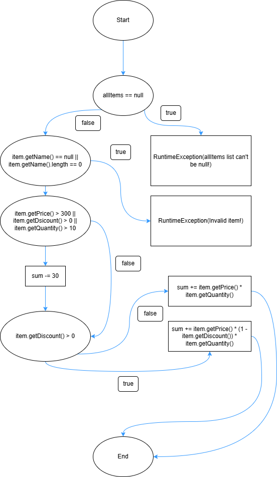

# Филип Николов, 231110

## Control Flow Graph

## Цикломатска комплексност

Цикломатската комплексност на checkCart е 9

Формула: P + 1
P е бројот на јазли. Во случајов P = 8 (6 if услови и 2 for циклуси)

## Тест случаи според критериумот Every Statement

| #   | Тест                                          | Очекуван резултат     |
| --- | --------------------------------------------- | --------------------- |
| 1   | List == null                                  | RuntimeException      |
| 2   | Invalid item name                             | RuntimeException      |
| 3   | Discounted item (Price > 300 & Quantity > 10) | -30 + Sum w/ Discount |
| 4   | Item without discount                         | Price \* Quantity     |
| 5   | Invalid card number                           | RuntimeException      |
| 6   | Invalid character in card number              | RuntimeException      |

## Тест случаи според критериумот Multiple Condition

| Цена > 300 | Попуст > 0 | Количина > 10 | Очекуван резултат |
| ---------- | ---------- | ------------- | ----------------- |
| false      | false      | false         | НЕ влегува во if  |
| false      | false      | true          | Влегува           |
| false      | true       | false         | Влегува           |
| false      | true       | true          | Влегува           |
| true       | false      | false         | Влегува           |
| true       | false      | true          | Влегува           |
| true       | true       | false         | Влегува           |
| true       | true       | true          | Влегува           |

## Објаснување на напишаните тестови

Тест метод `testEveryStatement()` ги проверува сите if услови во функцијата `checkCart` со минимален број тестови.
Тест метод `testMultipleCondition()` ги проверува сите 8 комбинации на логички вредности според Multiple Condition критериумот.

Секој тест користи `assertEquals()` или `try-catch` за да потврди правилен резултат или exception.
